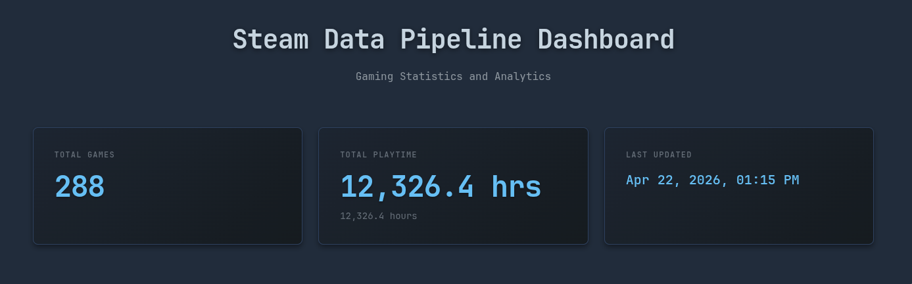
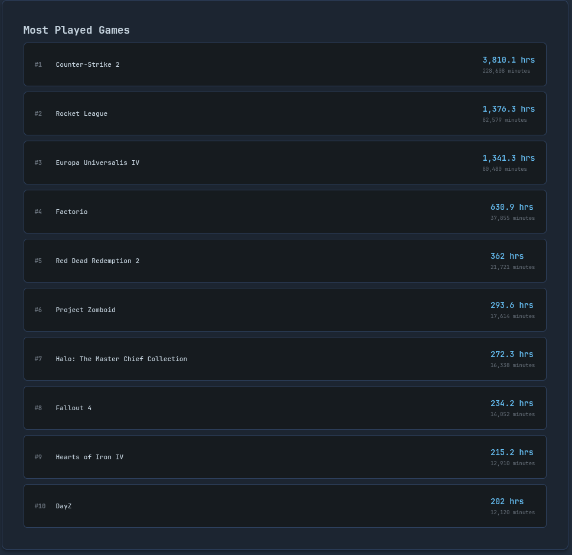
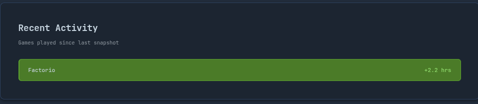
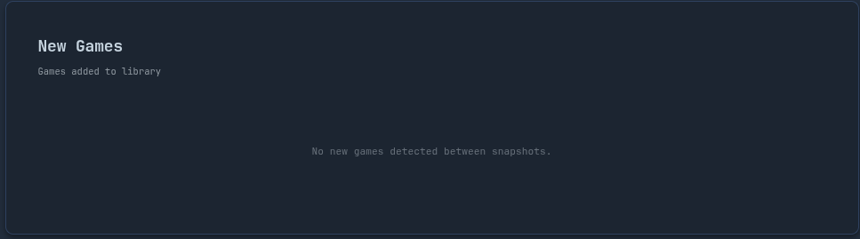
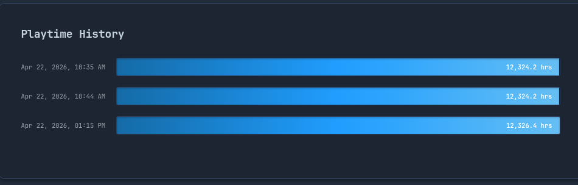

# Steam Data Pipeline

A professional data pipeline that ingests Steam user data, stores historical snapshots in MongoDB, and provides analytics through a REST API and interactive dashboard.



## Features

- **Automated Data Ingestion** - Fetch gaming data from Steam Web API
- **Historical Snapshots** - Track gaming activity over time with MongoDB
- **REST API** - Clean API endpoints for all analytics
- **Interactive Dashboard** - Steam-themed dark mode UI with real-time data visualization
- **Analytics Engine** - Playtime tracking, delta calculations, and trend analysis

## Dashboard Showcase

### Most Played Games
Track your top games with detailed playtime statistics.



### Recent Activity
See which games you've been playing since the last snapshot.



### New Games
Track new additions to your Steam library.



### Playtime History
Visualize your gaming trends over time with historical charts.



## Tech Stack

- **Python 3.x** - Backend language
- **Flask** - Web framework and REST API
- **MongoDB** - NoSQL database for time-series snapshots
- **Steam Web API** - Data source
- **JavaScript (Vanilla)** - Frontend with DOM manipulation
- **CSS3** - Steam-inspired dark theme design

## Project Structure

```
steam-data-pipeline/
├── app.py                        # Flask application
├── config.py                     # Configuration management
├── run_ingestion.py              # Data ingestion entry point
├── requirements.txt              # Python dependencies
├── templates/
│   └── dashboard.html            # Dashboard UI
├── static/
│   ├── css/dashboard.css         # Steam-themed styling
│   └── js/dashboard.js           # Frontend logic
├── src/
│   ├── clients/
│   │   └── steam_client.py       # Steam API client
│   ├── services/
│   │   ├── ingestion_service.py  # Data ingestion logic
│   │   └── analytics_service.py  # Analytics processing
│   ├── db/
│   │   └── mongo_client.py       # MongoDB operations
│   └── routes/
│       └── api_routes.py         # REST API endpoints
└── docs/
    └── images/                   # Screenshots
```

## Quick Start

### Prerequisites

- Python 3.x
- MongoDB
- Steam API Key ([Get one here](https://steamcommunity.com/dev/apikey))

### Installation

1. **Clone the repository**
```bash
git clone <your-repo-url>
cd steam-data-pipeline
```

2. **Set up virtual environment**
```bash
python -m venv venv
source venv/bin/activate  # On Windows: venv\Scripts\activate
```

3. **Install dependencies**
```bash
pip install -r requirements.txt
```

4. **Configure environment variables**

Create a `.env` file:
```env
STEAM_API_KEY=your_steam_api_key_here
STEAM_ID=your_steam_id_here
```

5. **Start MongoDB**
```bash
./start_mongodb.sh
```

### Usage

#### 1. Run Data Ingestion

Fetch your Steam data and store a snapshot:

```bash
python run_ingestion.py
```

Output:
```
Steam Data Pipeline - Ingestion Service
Fetching games from Steam API...
Found 288 games
Storing snapshot in MongoDB...
Snapshot stored successfully

Summary:
  Total Games: 288
  Total Playtime: 12,326.43 hours
```

#### 2. Start the Dashboard

Launch the web application:

```bash
python app.py
```

Then open your browser to:
- **Dashboard**: http://localhost:5000
- **API Docs**: http://localhost:5000/api

#### 3. Test the API

Run automated tests:

```bash
python test_dashboard.py
```

## REST API

### Available Endpoints

| Endpoint | Method | Description |
|----------|--------|-------------|
| `/` | GET | Dashboard UI |
| `/api` | GET | API documentation |
| `/health` | GET | Health check |
| `/api/stats` | GET | Overall statistics |
| `/api/playtime/total` | GET | Total playtime |
| `/api/playtime/history` | GET | Historical playtime data |
| `/api/playtime/deltas` | GET | Recent playtime changes |
| `/api/games/top` | GET | Most played games |
| `/api/games/new` | GET | Newly added games |

### Example API Response

**GET /api/stats**
```json
{
  "success": true,
  "data": {
    "total_games": 288,
    "total_playtime_hours": 12326.43,
    "total_playtime_minutes": 739586,
    "snapshot_timestamp": "2026-04-22T13:15:26.822000"
  }
}
```

**GET /api/games/top?limit=3**
```json
{
  "success": true,
  "count": 3,
  "data": [
    {
      "appid": 730,
      "name": "Counter-Strike 2",
      "playtime_hours": 3810.13,
      "playtime_minutes": 228608,
      "last_played": 1774048307
    },
    {
      "appid": 252950,
      "name": "Rocket League",
      "playtime_hours": 1376.32,
      "playtime_minutes": 82579,
      "last_played": 1776714271
    }
  ]
}
```

## Architecture

### Design Principles

- **Separation of Concerns**: Clear boundaries between API, business logic, and data access
- **Testability**: Each layer can be tested independently
- **Scalability**: Easy to add new data sources or storage backends
- **Production-Ready**: Follows industry best practices

### Data Flow

```
Steam API → Steam Client → Ingestion Service → MongoDB
                                                   ↓
User → Dashboard → Flask API → Analytics Service → MongoDB
```

### Why This Structure?

1. **clients/** - External API communication (Steam Web API)
2. **services/** - Business logic (ingestion, analytics)
3. **db/** - Database operations (MongoDB)
4. **routes/** - HTTP endpoints (Flask API)

This architecture ensures:
- Changes to Steam API don't affect database code
- Easy to swap MongoDB for another database
- Business logic is reusable across different interfaces
- Each component has a single responsibility

## MongoDB Management

### Useful Commands

```bash
# Check if MongoDB is running
pgrep mongod

# Stop MongoDB
pkill mongod

# View logs
tail -f /tmp/mongodb.log

# Query data with mongosh
mongosh
> use steam_data
> db.game_snapshots.countDocuments()
> db.game_snapshots.find().limit(1).pretty()
```

### View Stored Data

Use the included utility script:

```bash
python view_snapshots.py
```

## Development

### Running Tests

```bash
# Test dashboard and API endpoints
python test_dashboard.py
```

### Code Style

The codebase follows professional Python conventions:
- Clean, readable code without unnecessary comments
- Separation of HTML, CSS, and JavaScript
- No inline styles or scripts
- Proper DOM manipulation instead of innerHTML
- Comprehensive docstrings for complex functions

## Troubleshooting

**MongoDB won't start:**
- Check if another instance is running: `pgrep mongod`
- Kill existing process: `pkill mongod` and retry
- Check logs: `cat /tmp/mongodb.log`

**Connection refused:**
- Ensure MongoDB is running: `./start_mongodb.sh`
- Verify it's listening: `ss -tlnp | grep 27017`

**Steam API errors:**
- Verify your API key in `.env`
- Check your Steam ID is correct
- Ensure your Steam profile is public

**Dashboard shows no data:**
- Run ingestion at least once: `python run_ingestion.py`
- Check MongoDB has data: `python view_snapshots.py`
- Verify API is responding: `curl http://localhost:5000/health`

## Roadmap

- [x] Steam API integration
- [x] MongoDB storage with snapshots
- [x] Playtime delta calculations
- [x] New game detection
- [x] Flask REST API
- [x] Interactive dashboard with Steam theme
- [ ] Export data to CSV/JSON

## License

This project is open source and available under the [MIT License](LICENSE).

## Acknowledgments

- Steam Web API for providing gaming data
- Flask community for excellent documentation
- MongoDB for reliable time-series storage

---

**Note**: This is a personal project for tracking gaming statistics. Make sure to comply with Steam's API terms of service.
